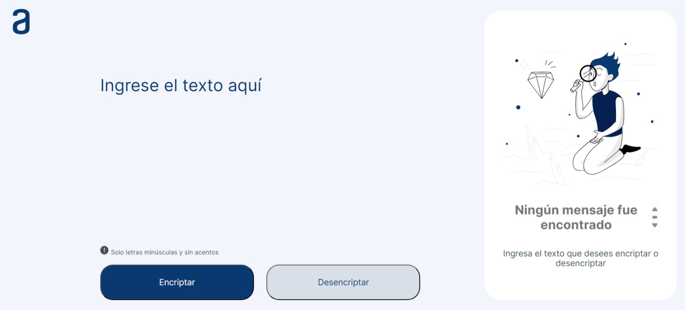

Challenge ONE Encriptador de Texto 🚀
===========
📋 Challenge ONE - Lógica de Programación - Encriptador de Texto.

El proyecto permite encriptar y desencriptar textos, lo que te permitirá intercambiar mensajes secretos con otras personas que conozcan el método de encriptación utilizado.

* https://michelhdez.github.io/Challenge-One-Encriptador-de-Texto/

## Realizado con 🛠️
* HTML
* CSS
* JS

## Autores ✒️
* **Michel Hdez** - (https://github.com/MichelHdez)
